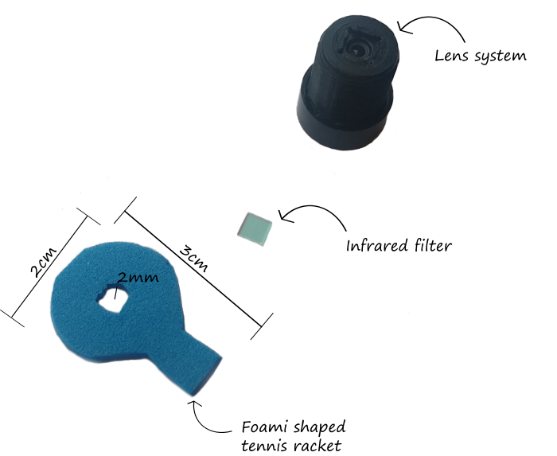

# Imágenes térmicas Con Cámaras Web
Este proyecto fue desarrollado en el curso de óptica y acústica de la Universidad Nacional de Colombia, para identificar la temperatura corporal mediante
una foto con cámara web sin su filtro Infrarrojo. Esto surge bajo la expectativa de poder identificar la temperatura de las personas de forma económica y segura, ya que no es necesario el contacto físico con el paciente, esto debido a la pandemia, llamada **COVID-19** que se está viviendo a nivel mundial. En este momento, tanto las condiciones de salubridad, como el mejoramiento de la situación ecónomica de las personas, es importante. Sin embargo, debido al confinamiento, muchos establecimientos de comercio han tenido que cerrar sus puertas definitivamente, ya que no pueden costear por sí mismos los softwares y maquinas necesarias para realizar el proceso de desinfección y medición de temperatura. Es así, que este proyecto propone una alternativa más economica a este problema.

**Advertencia:** El proyecto no tuvo resultados satisfactorios, debido a las limitaciones de las cámaras web. Así que se mostrará el desarrollo de este y las razones por las cuales las cámaras web no permiten realizar mediciones de temperaturas.

## Objetivos
1. Proporcionar a la sociedad una alternativa económica de medición de temperatura corporal, facil de usar y portable, con el uso de una cámara web.
2. Estudiar el comportamiento de la radiación infrarroja a traves del filtro de la camara web y así, entender el funcionamiento de este.
3. Estudiar las leyes físicas que reespladen el estudio de la radiación del cuerpo negro y la piel humana, como dos objetos con grandes similitudes, las cuales permitiran caracterizar la cámara, para luego ser puesta en funcionamiento con modelos humanos.
4. Realizar una guia de mdeición de temperatura para que el ususario pueda tomar las fotografías.
5. Diseñar un programa en MatLab que permita al usuario incluir las fotografías tomadas con la webcam y realizar la medición de temperatura.

## Experimentación
La componente experimental de proyecto, ha tenido diferentes enfoques y protocolos que fueron perfeccionados conforme se iba estudiando y aprendiendo sobre téctinas de toma de fotografías, esta evolucion correspondió a lo siguiente.

### 1. Primer Protocolo
En el primer protocolo de medición, se pensó que las luz natural podría afectar en las mediciones de temperatura, por lo que, las primeras imagenes que se tomarón, fueron completamente a oscuras, permitiendo así, el unico paso de la radiación infrarroja a través de la cámara. Sin embargo, estas fotografías no arrojaron resultados claros, debido a que igualmente, la cámara no podía percibir nada en su entorno, solamente los objetos con temperaturas bastante altas, como un cautin con temperatura de 332°c el cual brillaba.

### 2. Segundo Protocolo
El segundo protocolo consistió en poner, en lugar del filtro IR, un pequeño trozo de pelicula de camara analogica, ya que esta bloquea los rayos de luz natural, sin embargo, se observó que bloqueaba mas que solo la luz visible, dejando a un objeto caliente, totalmente invisible. Aunque posteriromente, se encontró qué, realmente la cámara tenía un rango en el espectro infrarrojo bastante bajo, lo cual implicaba que solo se prodía ver el efecto de la temepratura, si esta era bastante grande.

### 3. Tercer Protocolo

El tercer protocolo nacio con la idea de qué, en el procesamiento de las imagenes, quedara unicamente la región infrarroja del espectro, para esto, se decidió que debian tomarse dos fotografias, una de ellas, con el filtro infrarrojo, mientras que la otra se tomaría al mismo objeto sin este filtro. Luego, se restarian ambas fotos, con el fin de sustraer el espectro visisble, a continuación se muestra el procedimiento necesario para la toma de estas fotografías.

Se necesitará

  1. Cámara web Star Tec modelo St-hc-$338$, o cualquier tipo de cámara web.
  2. Foami (3cm x 3cm)
  3. Un punzón con punta fina.
  4. Termómetro.
  5. cinta adhesiva, tijeras y un palo de pincho.

#### Ajuste de la Webcam

Las cámaras web, en general, tienen un filtro infrarrojo en el arreglo de sus lentes. En algunas de ellas, es fácil extraer este filtro sin poner en riesgo el funcionamiento óptimo de la cámara. La cámara web que se usó en este experimento, proporciona al usuario un fácil acceso a este filtro, a continuación se muestran las instrucciones para extraer el filtro infrarrojo de la webcam Star Tec St-hc-338.

El primer paso consiste en desenrollar el arreglo de lentes de la cámara.

Luego de desenrollar el lente de la webcam, se puede observar en la parte posterior del lente, una pequeña pieza de vidrio iridiscente de 5mm x 5mm como se muestra en la siguiente figura.

Después de extraer este filtro, es necesario cortar el foami de tal forma que parezca una raqueta de tenis, con un pequeño orificio en la mitad, en donde va a situarse el filtro infrarrojo.

Después, volver a enrollar el sistema de lentes al cuerpo de la cámara y usando la cinta adhesiva, pegar la empuñadura de la raqueta de foami a la parte superior del lente de la cámara, esto, para permitir subir y bajar el filtro, sin mover la cámara.

Finalmente, se debe situar la cámara, de forma que esta quede estable y poner en frente el objeto al cual se desea poner la temperatura.

El palo de pincho sirve para subir y bajar el filtro sin que la cámara se mueva, debido a que estas deben quedar "iguales". Así que, el ultimo paso es tomar dos fotografías del mismo objeto, una con el filtro IR y una sin él.

Luego de ello, se realizará el procesamiento de las imágenes.

## Software
Este programa para el procesamiento de las imágenes se desarrolló en MatLab 2019b básico y adicionalmente se utilizó la libreria *Image Processing Toolbox*. Para el desarrollo del proyecto no es necesario clonar todo el repositorio. Los códigos necesarios se encuentran en la carpeta de ***Segmentacion_termica_para_objetos*** y ***Segmentacion_termica_para_personas***.

## Ejecución ⚙️
Los códigos son bastante amigables para quien quiera utilizarlos, lo único que tiene que hacer es compilarlos y escribir el nombre de las imágenes con y sin filtro junto con su extensión. Compile el código y asegurese que las imágenes que quiere analizar esten en la misma carpeta. Le aparecerá lo siguiente en la ventana de comando:

En nuestro caso vamos a utilizar una imagen que nombramos *color.jpg*, simplemente lo escribe, enter y pone la imágen que no tiene el filtro IR

A continuación le aparecerá una imagen con tres sub imágenes, en la tercera va a seleccionar el área que quiere analizar

Una vez recortado, en la misma imágen aparecerá la cuarta subimágen en donde se traza una linea o cuantas quiera para ver la intensidad de cada uno de los pixeles a lo largo de la linea trazada.

El perfil de intensidades

y La imagen segmentada junto con la temperatura

Cabe destacar qué, al igual que el desarrollo experimental, este código fue evolucionando con cada dato que se iba aprendiendo de las imagenes térmicas.

## Conclusiones
La temperatura del cautín es de 250° C o 523K, utilizando la ley de desplazamiento de Wien (la teoría está en la carpeta Base Teorica) sabemos que la longitud de onda emitida por el cautín es de 5.542 μm, emitiendo en el infrarrojo medio. Estas cámaras, solo alcanzan a leer una fracción del infrarrojo cercano. En el casod el cuerpo humano, se encontró que, la longitud de onda a la que emite es de 9.77 μm, el cual está en la región lejana del infarrojo, así que, bajo estas condiciones, es imposible medir la temperatura con una cámara web.

Se invita al lector a revisar los commits, ya que estos permiten ver como se en avanzó en el proyecto, a lo largo del tiempo.
